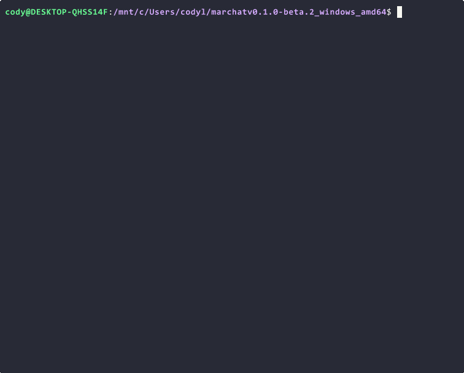
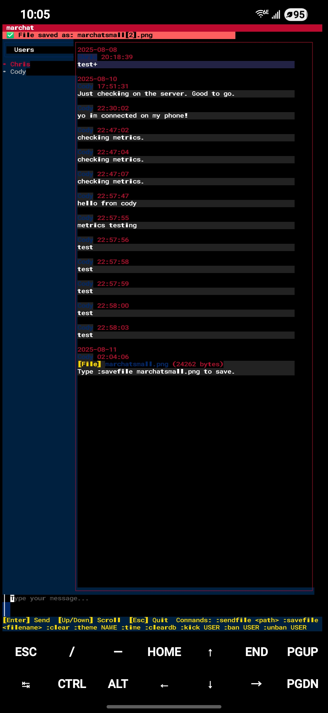
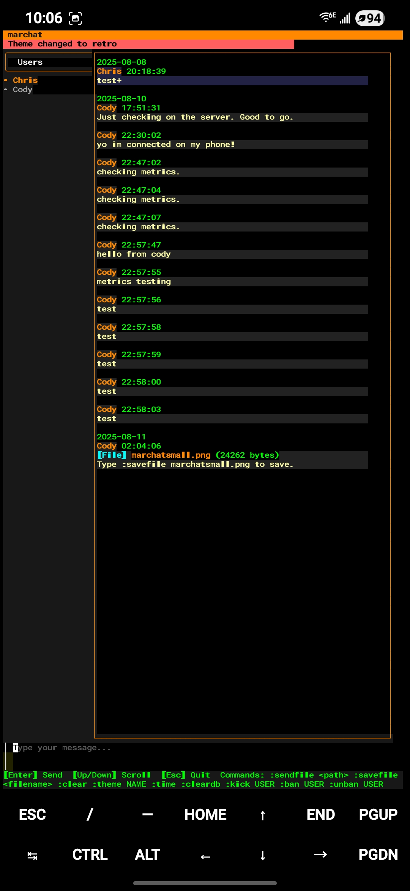

# marchat


[](https://github.com/Cod-e-Codes/marchat/actions/workflows/go.yml)
[](LICENSE)
[](https://go.dev/dl/)
[](https://github.com/Cod-e-Codes/marchat/releases)
[](https://hub.docker.com/r/codecodesxyz/marchat)
[](https://github.com/Cod-e-Codes/marchat/releases/tag/v0.10.0-beta.1)

A lightweight terminal chat with real-time messaging over WebSockets, optional E2E encryption, and a flexible plugin ecosystem. Built for developers who prefer the command line.

## Latest Updates

### v0.10.0-beta.1 (Current)
- **Message Management**: Edit, delete, pin, search messages by ID
- **Reactions**: React to messages with emoji aliases (`:react 42 +1`, `heart`, `fire`, `party`, etc.)
- **Direct Messages**: Private DM conversations between users
- **Channels**: Multiple chat rooms with join/leave and per-channel messaging
- **Typing Indicators**: See when other users are typing
- **E2E File Transfers**: End-to-end encryption extended to file sharing
- **UX Enhancements**: Connection status indicator, @mention tab completion, unread count, multi-line input (Alt+Enter/Ctrl+J), chat history export
- **Security**: Rate limiting, constant-time admin key comparison, plugin download timeouts, SHA-pinned CI actions
- **Refactoring**: Client split into hotkeys/render/websocket/commands modules, config directory unified, orphaned code removed
- **Docker**: Added docker-compose.yml for local development
- **Plugins**: Full plugin system wiring (message forwarding, user list updates, command responses, init handshake, store UI, license enforcement)

### Recent Releases
- **v0.9.0-beta.6**: Rebuilt with Go 1.25.8 to address CVE-2026-25679, CVE-2026-27142, CVE-2026-27139
- **v0.9.0-beta.5**: Automated release workflow, PBKDF2 keystore key derivation, JWT secret auto-generation, race condition fixes, Docker optimizations
- **v0.9.0-beta.4**: Fixed admin metrics, restored plugin commands in encrypted sessions, dependency updates
- **v0.9.0-beta.3**: Added :q quit command, improved theme handling, ESC behavior tweaks, and better database backups
- **v0.9.0-beta.2**: Database performance improvements, documentation enhancements, dependency updates
- **v0.9.0-beta.1**: Enhanced notifications, custom themes, plugin ecosystem, test coverage improvements
- **v0.8.0-beta.11**: Encryption UI, hotkey alternatives, command encryption fix, username validation
- **v0.8.0-beta.10**: Plugin persistence, state management, auto-discovery, deadlock fixes

Full changelog on [GitHub releases](https://github.com/Cod-e-Codes/marchat/releases).




## Features

- **Terminal UI** - Beautiful TUI built with Bubble Tea
- **Real-time Chat** - Fast WebSocket messaging with SQLite backend (PostgreSQL/MySQL planned)
- **Message Management** - Edit, delete, pin, react to, and search messages
- **Direct Messages** - Private DM conversations between users
- **Channels** - Multiple chat rooms with join/leave and per-channel messaging
- **Typing Indicators** - See when other users are typing
- **Read Receipts** - Message read acknowledgement (broadcast-level)
- **Plugin System** - Remote registry with text commands and Alt+key hotkeys
- **E2E Encryption** - X25519/ChaCha20-Poly1305 with global encryption, including file transfers
- **File Sharing** - Send files up to 1MB (configurable) with interactive picker and optional E2E encryption
- **Admin Controls** - User management, bans, kick system with ban history gaps
- **Smart Notifications** - Bell + desktop notifications with quiet hours and focus mode ([guide](NOTIFICATIONS.md))
- **Themes** - Built-in themes + custom themes via JSON ([guide](THEMES.md))
- **Docker Support** - Containerized deployment with `docker-compose.yml` for local dev
- **Health Monitoring** - `/health` and `/health/simple` endpoints with system metrics
- **Structured Logging** - JSON logs with component separation and user tracking
- **UX Enhancements** - Connection status indicator, tab completion for @mentions, unread message count, multi-line input, chat export
- **Cross-Platform** - Runs on Linux, macOS, Windows, and Android/Termux
- **Diagnostics** - `marchat-client -doctor` and `marchat-server -doctor` (or `-doctor-json`) summarize environment, resolved paths, and configuration health

## Overview

marchat started as a fun weekend project for father-son coding sessions and has evolved into a lightweight, self-hosted terminal chat application designed specifically for developers who love the command line. Currently runs with SQLite, with PostgreSQL and MySQL support planned for greater scalability.

**Key Benefits:**
- **Self-hosted**: No external services required
- **Cross-platform**: Linux, macOS, Windows, and Android/Termux
- **Secure**: Optional E2E encryption with X25519/ChaCha20-Poly1305
- **Extensible**: Plugin ecosystem for custom functionality
- **Lightweight**: Minimal resource usage, perfect for servers

| Cross-Platform | Theme Switching |
|---------------|----------------|
|  |  |

## Quick Start

### 1. Generate Admin Key
```bash
openssl rand -hex 32
```

### 2. Start Server

**Option A: Environment Variables (Recommended)**
```bash
export MARCHAT_ADMIN_KEY="your-generated-key"
export MARCHAT_USERS="admin1,admin2"
./marchat-server

# With admin panel
./marchat-server --admin-panel

# With web panel
./marchat-server --web-panel
```

**Option B: Interactive Setup**
```bash
./marchat-server --interactive
```

### 3. Connect Client
```bash
# Admin connection
./marchat-client --username admin1 --admin --admin-key your-key --server ws://localhost:8080/ws

# Regular user
./marchat-client --username user1 --server ws://localhost:8080/ws

# Or use interactive mode
./marchat-client
```

## Database Schema

Key tables for message tracking and moderation:
- **messages**: Core message storage with `message_id`
- **user_message_state**: Per-user message history state
- **ban_history**: Ban/unban event tracking for history gaps

## Installation

**Binary Installation:**
```bash
# Linux (amd64)
wget https://github.com/Cod-e-Codes/marchat/releases/download/v0.10.0-beta.1/marchat-v0.10.0-beta.1-linux-amd64.zip
unzip marchat-v0.10.0-beta.1-linux-amd64.zip && chmod +x marchat-*

# macOS (amd64)
wget https://github.com/Cod-e-Codes/marchat/releases/download/v0.10.0-beta.1/marchat-v0.10.0-beta.1-darwin-amd64.zip
unzip marchat-v0.10.0-beta.1-darwin-amd64.zip && chmod +x marchat-*

# Windows - PowerShell
iwr -useb https://raw.githubusercontent.com/Cod-e-Codes/marchat/main/install.ps1 | iex
```

**Docker:**
```bash
docker pull codecodesxyz/marchat:v0.10.0-beta.1
docker run -d -p 8080:8080 \
  -e MARCHAT_ADMIN_KEY=$(openssl rand -hex 32) \
  -e MARCHAT_USERS=admin1,admin2 \
  codecodesxyz/marchat:v0.10.0-beta.1
```

**Docker Compose (local development):**
```bash
docker compose up -d
```

**From Source:**
```bash
git clone https://github.com/Cod-e-Codes/marchat.git && cd marchat
go mod tidy
go build -o marchat-server ./cmd/server
go build -o marchat-client ./client
```

**Prerequisites for source build:**
- Go 1.25+ ([download](https://go.dev/dl/))
- Linux clipboard support: `sudo apt install xclip` (Ubuntu/Debian) or `sudo yum install xclip` (RHEL/CentOS)

## Configuration

### Essential Environment Variables

| Variable | Required | Default | Description |
|----------|----------|---------|-------------|
| `MARCHAT_ADMIN_KEY` | Yes | - | Admin authentication key |
| `MARCHAT_USERS` | Yes | - | Comma-separated admin usernames |
| `MARCHAT_PORT` | No | `8080` | Server port |
| `MARCHAT_DB_PATH` | No | `./config/marchat.db` | Database file path |
| `MARCHAT_TLS_CERT_FILE` | No | - | TLS certificate (enables wss://) |
| `MARCHAT_TLS_KEY_FILE` | No | - | TLS private key |
| `MARCHAT_GLOBAL_E2E_KEY` | No | - | Base64 32-byte global encryption key |
| `MARCHAT_MAX_FILE_BYTES` | No | `1048576` | Max file size in bytes (1MB default) |
| `MARCHAT_MAX_FILE_MB` | No | `1` | Max file size in MB (alternative to bytes) |
| `MARCHAT_ALLOWED_USERS` | No | - | Username allowlist (comma-separated) |

**Additional variables:** `MARCHAT_LOG_LEVEL`, `MARCHAT_CONFIG_DIR`, `MARCHAT_BAN_HISTORY_GAPS`, `MARCHAT_PLUGIN_REGISTRY_URL`

**Doctor / diagnostics:** `MARCHAT_DOCTOR_NO_NETWORK` — set to `1` to skip the GitHub latest-release check in `-doctor` / `-doctor-json`.

**File Size Configuration:** Use either `MARCHAT_MAX_FILE_BYTES` (exact bytes) or `MARCHAT_MAX_FILE_MB` (megabytes). If both are set, `MARCHAT_MAX_FILE_BYTES` takes priority.

**Interactive Setup:** Use `--interactive` flag for guided server configuration when environment variables are missing.

### Client vs server config locations

| Role | Default location | Override |
|------|------------------|----------|
| **Server** (`.env`, SQLite DB, debug log) | In development from a repo clone: `./config` next to `go.mod`. Otherwise `MARCHAT_CONFIG_DIR` or the user config path (see [ARCHITECTURE.md](ARCHITECTURE.md)). | `MARCHAT_CONFIG_DIR`, `--config-dir` |
| **Client** (`config.json`, `profiles.json`, keystore, `themes.json`) | Per-user app data (e.g. Windows `%APPDATA%\marchat`, Linux/macOS `~/.config/marchat`). Same when developing from source. | `MARCHAT_CONFIG_DIR` |

The repository’s `config/` directory holds **server** runtime files and the **Go package** `github.com/Cod-e-Codes/marchat/config`; it is not the client’s profile folder.

### Diagnostics (`-doctor`)

Run **`./marchat-client -doctor`** or **`./marchat-server -doctor`** for a text report (paths, masked `MARCHAT_*` env, sanity checks). Use **`-doctor-json`** for machine-readable output. If both flags were passed, `-doctor-json` wins. Exits without starting the TUI or listening on a port. See [ARCHITECTURE.md](ARCHITECTURE.md) for details.

## Admin Commands

### User Management
| Command | Description | Hotkey |
|---------|-------------|--------|
| `:ban <user>` | Permanent ban | `Ctrl+B` (with user selected) |
| `:kick <user>` | 24h temporary ban | `Ctrl+K` (with user selected) |
| `:unban <user>` | Remove permanent ban | `Ctrl+Shift+B` |
| `:allow <user>` | Override kick early | `Ctrl+Shift+A` |
| `:forcedisconnect <user>` | Force disconnect user | `Ctrl+F` (with user selected) |
| `:cleanup` | Clean stale connections | - |

### Database Operations (`:cleardb` or `Ctrl+D` menu)
- **Clear DB** - Wipe all messages
- **Backup DB** - Create database backup
- **Show Stats** - Display database statistics

## User Commands

### General
| Command | Description | Hotkey |
|---------|-------------|--------|
| `:theme <name>` | Switch theme (built-in or custom) | `Ctrl+T` (cycles) |
| `:themes` | List all available themes | - |
| `:time` | Toggle 12/24-hour format | `Alt+T` |
| `:clear` | Clear chat buffer | `Ctrl+L` |
| `:q` | Quit application (vim-style) | - |
| `:sendfile [path]` | Send file (or open picker without path) | `Alt+F` |
| `:savefile <name>` | Save received file | - |
| `:code` | Open code composer with syntax highlighting | `Alt+C` |
| `:export [file]` | Export chat history to a text file | - |

### Messaging
| Command | Description |
|---------|-------------|
| `:edit <id> <text>` | Edit a message by its ID |
| `:delete <id>` | Delete a message by its ID |
| `:dm [user] [msg]` | Send a DM or toggle DM mode (no args exits DM mode) |
| `:search <query>` | Search message history on the server |
| `:react <id> <emoji>` | React to a message (supports aliases: `+1`, `heart`, `fire`, `party`, `laugh`, `eyes`, `check`, `rocket`, `think`, etc.) |
| `:pin <id>` | Toggle pin on a message |
| `:pinned` | List all pinned messages |

### Channels
| Command | Description |
|---------|-------------|
| `:join <channel>` | Join a channel (clients start in `#general`) |
| `:leave` | Leave current channel, return to `#general` |
| `:channels` | List active channels with user counts |

### Notifications
| Command | Description | Hotkey |
|---------|-------------|--------|
| `:notify-mode <mode>` | Set notification mode (none/bell/desktop/both) | `Alt+N` (toggle desktop) |
| `:bell` | Toggle bell notifications | - |
| `:bell-mention` | Toggle mention-only notifications | - |
| `:focus [duration]` | Enable focus mode (mute notifications) | - |
| `:quiet <start> <end>` | Set quiet hours (e.g., `:quiet 22 8`) | - |

> **Note**: Hotkeys work in both encrypted and unencrypted sessions since they're handled client-side.
>
> **Notifications**: See [NOTIFICATIONS.md](NOTIFICATIONS.md) for full notification system documentation including desktop notifications, quiet hours, and focus mode.

### Plugin Commands (Admin Only)

Text commands and hotkeys for plugin management. See [Plugin Management hotkeys](#plugin-management-admin) for keyboard shortcuts.

| Command | Description | Hotkey |
|---------|-------------|--------|
| `:store` | Browse plugin store | `Alt+S` |
| `:plugin list` or `:list` | List installed plugins | `Alt+P` |
| `:plugin install <name>` or `:install <name>` | Install plugin | `Alt+I` |
| `:plugin uninstall <name>` or `:uninstall <name>` | Uninstall plugin | `Alt+U` |
| `:plugin enable <name>` or `:enable <name>` | Enable plugin | `Alt+E` |
| `:plugin disable <name>` or `:disable <name>` | Disable plugin | `Alt+D` |
| `:refresh` | Refresh plugin list from registry | `Alt+R` |

> **Note**: Both text commands and hotkeys work in E2E encrypted sessions (sent as admin messages that bypass encryption).

### File Sharing

**Direct send:**
```bash
:sendfile /path/to/file.txt
```

**Interactive picker:**
```bash
:sendfile
```
Navigate with arrow keys, Enter to select/open folders, ".. (Parent Directory)" to go up.

**Supported types:** Text, code, images, documents, archives (`.txt`, `.md`, `.json`, `.go`, `.py`, `.js`, `.png`, `.jpg`, `.pdf`, `.zip`, etc.)

## Keyboard Shortcuts

### General
| Key | Action |
|-----|--------|
| `Ctrl+H` | Toggle help overlay |
| `Enter` | Send message |
| `Alt+Enter` / `Ctrl+J` | Insert newline (multi-line input) |
| `Tab` | Autocomplete @mentions |
| `Esc` | Close menus / dialogs |
| `:q` | Quit application (vim-style) |
| `↑/↓` | Scroll chat |
| `PgUp/PgDn` | Page through chat |
| `Ctrl+C/V/X/A` | Copy/Paste/Cut/Select all |

### User Features
| Key | Action |
|-----|--------|
| `Alt+F` | Send file (file picker) |
| `Alt+C` | Create code snippet |
| `Ctrl+T` | Cycle themes |
| `Alt+T` | Toggle 12/24h time |
| `Alt+N` | Toggle desktop notifications |
| `Ctrl+L` | Clear chat history |

> **Multi-line input**: Use `Alt+Enter` or `Ctrl+J` to insert newlines. `Shift+Enter` is not reliably supported on Windows terminals.

### Admin Interface (Client)
| Key | Action |
|-----|--------|
| `Ctrl+U` | Select/cycle user |
| `Ctrl+D` | Database operations menu |
| `Ctrl+K` | Kick selected user |
| `Ctrl+B` | Ban selected user |
| `Ctrl+F` | Force disconnect selected user |
| `Ctrl+Shift+B` | Unban user (prompts for username) |
| `Ctrl+Shift+A` | Allow user (prompts for username) |

### Plugin Management (Admin)
| Key | Action |
|-----|--------|
| `Alt+P` | List installed plugins |
| `Alt+S` | View plugin store |
| `Alt+R` | Refresh plugin list |
| `Alt+I` | Install plugin (prompts for name) |
| `Alt+U` | Uninstall plugin (prompts for name) |
| `Alt+E` | Enable plugin (prompts for name) |
| `Alt+D` | Disable plugin (prompts for name) |

### Server
| Key | Action |
|-----|--------|
| `Ctrl+A` | Open terminal admin panel |

## Admin Panels

### Terminal Admin Panel
Enable with `--admin-panel` flag, then press `Ctrl+A` to access:
- Real-time server statistics (users, messages, performance)
- User management interface
- Plugin configuration
- Database operations
- Requires terminal environment (auto-disabled in systemd/non-terminal)

### Web Admin Panel
Enable with `--web-panel` flag, access at `http://localhost:8080/admin`:
- Secure session-based login (1-hour expiration)
- Live dashboard with metrics visualization
- RESTful API endpoints with `X-Admin-Key` auth
- CSRF protection on all state-changing operations
- HttpOnly cookies with SameSite protection

**API Example:**
  ```bash
curl -H "Cookie: admin_session=YOUR_SESSION" http://localhost:8080/admin/api/overview
  ```

## TLS Support

### When to Use TLS

- **Public deployments**: Server accessible from internet
- **Production environments**: Enhanced security required
- **Corporate networks**: Security policy compliance
- **HTTPS reverse proxies**: Behind nginx, traefik, etc.

### Configuration Examples

**With TLS (production):**
```bash
# Generate self-signed cert (testing only)
openssl req -x509 -newkey rsa:4096 -keyout key.pem -out cert.pem -days 365 -nodes

export MARCHAT_ADMIN_KEY="your-key"
export MARCHAT_USERS="admin1,admin2"
export MARCHAT_TLS_CERT_FILE="./cert.pem"
export MARCHAT_TLS_KEY_FILE="./key.pem"
./marchat-server  # Shows wss:// in banner
```

**Without TLS (development):**
```bash
export MARCHAT_ADMIN_KEY="your-key"
export MARCHAT_USERS="admin1,admin2"
./marchat-server  # Shows ws:// in banner
```

**Client with TLS:**
```bash
# With verification (production)
./marchat-client --server wss://localhost:8080/ws

# Skip verification (dev/self-signed only)
./marchat-client --skip-tls-verify --server wss://localhost:8080/ws
```

> **Warning**: Use `--skip-tls-verify` only for development. Production should use valid CA-signed certificates.

## E2E Encryption

Global encryption for secure group chat using shared keys across all clients.

### How It Works
- **Shared Key Model**: All clients use same global encryption key for public channels
- **Simplified Management**: No complex per-user key exchange
- **X25519/ChaCha20-Poly1305**: Industry-standard encryption algorithms
- **Environment Variable**: `MARCHAT_GLOBAL_E2E_KEY` for key distribution
- **Auto-Generation**: Creates new key if none provided

### Setup Options

**Option 1: Shared Key (Recommended)**
```bash
# Generate 32-byte key
openssl rand -base64 32

# Set on all clients
export MARCHAT_GLOBAL_E2E_KEY="your-generated-key"

# Connect with E2E
./marchat-client --e2e --keystore-passphrase your-pass --username alice --server ws://localhost:8080/ws
```

**Option 2: Auto-Generate**
```bash
# Client generates and displays new key
./marchat-client --e2e --keystore-passphrase your-pass --username alice --server ws://localhost:8080/ws

# Output shows:
# 🔐 Generated new global E2E key (ID: RsLi9ON0...)
# 💡 Set MARCHAT_GLOBAL_E2E_KEY=fF+HkmGArkPNsdb+... to share this key
```

### Expected Output
```
🔐 Using global E2E key from environment variable
🌐 Global chat encryption: ENABLED (Key ID: RsLi9ON0...)
✅ Encryption validation passed
🔐 E2E encryption enabled with keystore: config/keystore.dat
```

### Security Features
- **Forward Secrecy**: Unique session keys per conversation
- **Server Privacy**: Server cannot read encrypted messages
- **Local Keystore**: Encrypted with passphrase protection using PBKDF2
- **Validation**: Automatic encryption/decryption testing on startup

**Note**: Keystore encryption was upgraded from SHA256 to PBKDF2 for enhanced security. Existing keystores encrypted with the old method will need to be re-initialized.

## Plugin System

Extend functionality with remote plugins from configured registry.

### Configuration
```bash
# Default GitHub registry
export MARCHAT_PLUGIN_REGISTRY_URL="https://raw.githubusercontent.com/Cod-e-Codes/marchat-plugins/main/registry.json"

# Custom registry
export MARCHAT_PLUGIN_REGISTRY_URL="https://my-registry.com/plugins.json"
```

### Commands

**Text commands:**
```bash
:store                    # Browse available plugins
:plugin install echo      # Install plugin
:plugin list              # List installed
:plugin uninstall echo    # Remove plugin
:enable echo              # Enable installed plugin
:disable echo             # Disable plugin
:refresh                  # Refresh plugin registry
```

**Keyboard shortcuts** (Admin only):
- `Alt+P` - List installed plugins
- `Alt+S` - View plugin store  
- `Alt+R` - Refresh plugin list
- `Alt+I` - Install plugin (prompts for name)
- `Alt+U` - Uninstall plugin (prompts for name)
- `Alt+E` - Enable plugin (prompts for name)
- `Alt+D` - Disable plugin (prompts for name)

> **Note**: Plugin management commands and custom plugin commands (e.g., `:echo`) work in E2E encrypted sessions. See [Plugin Commands](#plugin-commands-admin-only) for full reference.

### Available Plugins
- **echo** (v2.0.1): Simple echo plugin for testing (provides `:echo` command)
- **weather** (v1.0.0): Get weather information and forecasts using wttr.in (`:weather [location]`, `:forecast [location]`)
- **githooks** (v1.0.0): Git repository management with status, log, branch, and diff commands (`:git-status`, `:git-log`, `:git-branch`, `:git-diff`, `:git-watch` admin-only)

See [PLUGIN_ECOSYSTEM.md](PLUGIN_ECOSYSTEM.md) for development guide.

## Moderation System

**Temporary Kicks (24 hours):**
- `:kick <username>` or `Ctrl+K` for temporary discipline
- Auto-allowed after 24 hours, or override early with `:allow`
- Ideal for cooling-off periods

**Permanent Bans (indefinite):**
- `:ban <username>` or `Ctrl+B` for serious violations
- Remains until manual `:unban` or `Ctrl+Shift+B`
- Ideal for persistent troublemakers

**Ban History Gaps:**
Prevents banned users from seeing messages sent during ban periods. Enable with `MARCHAT_BAN_HISTORY_GAPS=true` (disabled by default).

## Client Configuration

### Interactive Mode (Default)
```bash
./marchat-client
```
Guides through server URL, username, admin privileges, E2E encryption, theme selection, and profile saving.

### Quick Start Options
```bash
# Auto-connect to recent profile
./marchat-client --auto

# Select from saved profiles
./marchat-client --quick-start
```

### Profile Management
Profiles stored in platform-appropriate locations:
- **Windows**: `%APPDATA%\marchat\profiles.json`
- **macOS**: `~/Library/Application Support/marchat/profiles.json`  
- **Linux**: `~/.config/marchat/profiles.json`

**During profile selection:**
- `i` or `v` - View profile details
- `r` - Rename profile
- `d` - Delete profile

### Traditional Flags
```bash
# Basic connection
./marchat-client --server ws://localhost:8080/ws --username alice

# Admin connection
./marchat-client --server ws://localhost:8080/ws --username admin --admin --admin-key your-key

# E2E encrypted
./marchat-client --server ws://localhost:8080/ws --username alice --e2e --keystore-passphrase your-pass

# Non-interactive (requires all flags)
./marchat-client --non-interactive --server ws://localhost:8080/ws --username alice
```

## Security Best Practices

1. **Generate Secure Keys**
   ```bash
   # Admin key (64 hex characters)
   openssl rand -hex 32
   
   # Global E2E key (base64-encoded 32 bytes)
   openssl rand -base64 32
   ```

2. **Secure File Permissions**
   ```bash
   chmod 600 ./config/marchat.db    # Database
   chmod 600 ./config/keystore.dat  # Keystore
   chmod 700 ./config               # Config directory
   ```

3. **Production Deployment**
   - Use TLS (`wss://`) with valid CA-signed certificates
   - Deploy behind reverse proxy (nginx/traefik)
   - Restrict server access to trusted networks
   - Use Docker secrets for sensitive environment variables
   - Enable rate limiting and brute force protection
   - Monitor security logs regularly

4. **E2E Encryption**
   - Store `MARCHAT_GLOBAL_E2E_KEY` securely
   - Use strong keystore passphrases
   - Never share keystores between users
   - Rotate keys periodically for sensitive deployments

5. **Username Allowlist (Optional)**
   ```bash
   # Restrict to specific users for private servers
   export MARCHAT_ALLOWED_USERS="alice,bob,charlie"
   ```
   - Usernames validated (letters, numbers, `_`, `-`, `.` only)
   - Max 32 characters, cannot start with `:` or `.`
   - Case-insensitive matching
   - Protects against log injection and command injection

## Troubleshooting

| Issue | Solution |
|-------|----------|
| Wrong config folder / paths | Run `marchat-client -doctor` or `marchat-server -doctor`; see **Client vs server config locations** |
| Connection failed | Verify `ws://` or `wss://` protocol in URL |
| Admin commands not working | Check `--admin` flag and correct `--admin-key` |
| Clipboard issues (Linux) | Install xclip: `sudo apt install xclip` |
| Port in use | Change port: `export MARCHAT_PORT=8081` |
| Database migration fails | Check file permissions, backup before source build |
| Message history missing | Expected after updates - user states reset for ban/unban improvements |
| Ban history gaps not working | Ensure `MARCHAT_BAN_HISTORY_GAPS=true` (disabled by default) and `ban_history` table exists |
| TLS certificate errors | Use `--skip-tls-verify` for dev with self-signed certs |
| Plugin installation fails | Verify `MARCHAT_PLUGIN_REGISTRY_URL` is accessible and valid JSON |
| E2E encryption errors | Ensure `--e2e` flag and keystore passphrase provided, check debug logs |
| Global E2E key errors | Verify key is valid base64-encoded 32-byte key: `openssl rand -base64 32` |
| Blank encrypted messages | Fixed in v0.3.0-beta.5+ - ensure latest version |
| Username already taken | Use admin `:forcedisconnect <user>` or wait 5min for auto-cleanup |
| Stale connections | Server auto-cleans every 5min, or admin use `:cleanup` |
| Client frozen at startup | Fixed in latest - `--quick-start` uses proper UI |
| Multi-line input not working | Use `Alt+Enter` or `Ctrl+J` — `Shift+Enter` is not supported in most Windows terminals |

### Stale Connection Management

**Automatic:** Server detects and removes stale connections every 5 minutes using WebSocket ping.

**Manual (Admin):**
```bash
:cleanup                    # Clean all stale connections
:forcedisconnect username   # Force disconnect specific user
```

**Common scenarios:**
- Client crash/Ctrl+C: Auto-cleaned within 5 minutes
- Network interruption: Removed on next cleanup cycle
- Immediate reconnect: Admin uses `:forcedisconnect`

## Testing

Foundational test suite covering core functionality, cryptography, and plugins.

### Running Tests
```bash
go test ./...              # Run all tests
go test -cover ./...       # With coverage
go test ./server -v        # Specific package
go test ./... -timeout 10s # With timeout (CI recommended)
```

### Test Scripts
- **Linux/macOS**: `./test.sh`
- **Windows**: `.\test.ps1`

### Coverage Summary
| Package | Coverage | Size | Status |
|---------|----------|------|--------|
| `shared` | 85.9% | 348 LOC | High |
| `plugin/license` | 83.1% | 229 LOC | High |
| `client/crypto` | 79.5% | 354 LOC | High |
| `config` | 73.2% | 327 LOC | High |
| `client/config` | 54.5% | 1862 LOC | Medium |
| `plugin/store` | 47.0% | 552 LOC | Medium |
| `cmd/license` | 42.2% | 160 LOC | Medium |
| `server` | 33.7% | 6558 LOC | Medium |
| `plugin/manager` | 23.8% | 747 LOC | Low |
| `client` | 23.3% | 5334 LOC | Low |
| `plugin/host` | 21.1% | 617 LOC | Low |
| `cmd/server` | 5.3% | 455 LOC | Low |

**Overall: 34.1%** - See [TESTING.md](TESTING.md) for detailed information.

## Contributing

We welcome contributions! See [CONTRIBUTING.md](CONTRIBUTING.md) for:
- Development setup instructions
- Code style guidelines and conventions
- Pull request process and requirements
- Testing expectations

**Quick Start:**
```bash
git clone https://github.com/Cod-e-Codes/marchat.git
cd marchat
go mod tidy
go test ./...
```

## Documentation

- **[NOTIFICATIONS.md](NOTIFICATIONS.md)** - Notification system guide (desktop, quiet hours, focus mode)
- **[THEMES.md](THEMES.md)** - Custom theme creation guide
- **[PLUGIN_ECOSYSTEM.md](PLUGIN_ECOSYSTEM.md)** - Plugin development guide
- **[ROADMAP.md](ROADMAP.md)** - Planned features and enhancements
- **[TESTING.md](TESTING.md)** - Comprehensive testing guide
- **[CONTRIBUTING.md](CONTRIBUTING.md)** - Contribution guidelines
- **[SECURITY.md](SECURITY.md)** - Security policy and reporting
- **[CONTRIBUTORS.md](CONTRIBUTORS.md)** - Full contributor list

## Getting Help

- [Report bugs](https://github.com/Cod-e-Codes/marchat/issues)
- [Ask questions](https://github.com/Cod-e-Codes/marchat/discussions)
- Commercial support: [cod.e.codes.dev@gmail.com](mailto:cod.e.codes.dev@gmail.com)

## Appreciation

Thanks to [Self-Host Weekly](https://selfh.st/weekly/2025-07-25/), [mtkblogs.com](https://mtkblogs.com/2025/07/23/marchat-a-go-powered-terminal-chat-app-for-the-modern-user/), and [Terminal Trove](https://terminaltrove.com/) for featuring marchat!

See [CONTRIBUTORS.md](CONTRIBUTORS.md) for full contributor list.

---

**License**: [MIT License](LICENSE)
